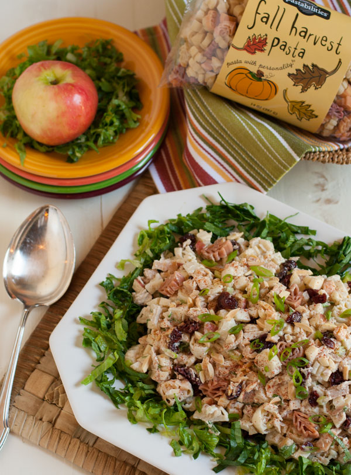

# Tuna pasta salad

Author: Mary Clarke

From: https://pastashoppe.com/pasta-salad-with-tuna-apple-and-dried-cranberries/

## Ingredients:
- [ ] 200 g pasta, cooked according to package directions.
- [ ] 2 small cans of tuna packed in water
- [ ] 125 g dried cranberries
- [ ] 1 pink lady apple, chopped
- [ ] 4 spring onions, chopped
- [ ] 60 g almonds flakes, toasted (save some for garnish)
- [ ] 60 g mayo
- [ ] Romaine lettuce

## Method:
1. Cook pasta according to package directions, drain, and rinse with cold water.
2. Carefully combine and toss all ingredients in a large bowl.
3. Adjust seasonings to taste with salt and pepper.
4. Serve pasta salad over a bed of Romaine lettuce or in individual Butter lettuce leaves as a wrap!