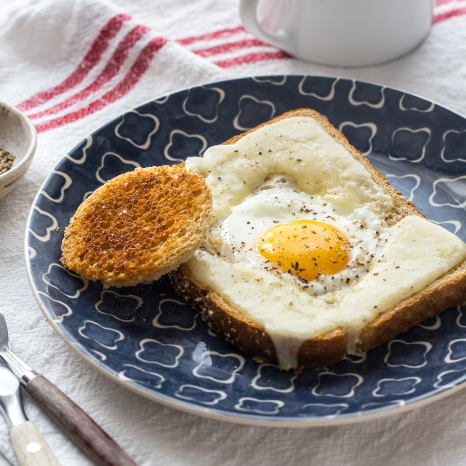

# egg in a basket

Author: 

## Equipment: 
- pint glass
- frying pan

## Ingredients:
- [ ] 3 grams salt
- [ ] 0.5 g pepper
- [ ] 1 large egg
- [ ] 1 slice bread
- [ ] butter

## Method:
1. butter the slice of bread
2. cut out the lid with the pint glass
3. fry the lid with salt and pepper
4. briefly fry the bread on one side, then flip it
5. separate the egg white and yolk. Pour the white into the bread hole and fry until it is opaque
6. place the yolk carefully on top. Add salt and pepper. Fry until the yolk is warm and the white is fully cooked (no jiggly bits).