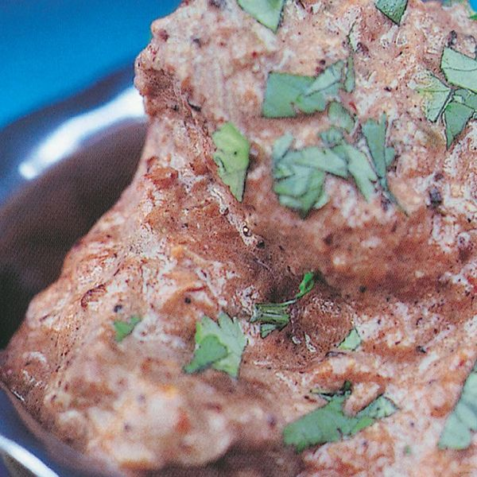

# Lamb pork or beef madras

Author: Madhur Jaffrey

From: https://thehappyfoodie.co.uk/recipes/lamb-pork-or-beef-madras

Notes: In the UK, Madras has come to mean a very hot curry and not much more. Here is a more authentic southern porial, which traditionally uses coriander seeds, peppercorns, fennel and fenugreek seeds in its spice mixture. It is quite hot as well, and quite delicious.

## Ingredients:
- [ ] 1 tbsp  coriander seeds
- [ ] 1 tsp black peppercorns
- [ ] 1 tsp fennel seeds
- [ ] 10 fenugreek seeds
- [ ] 4 cloves
- [ ] 4 dried hot red chillies
- [ ] 6 tbsp olive or groundnut oil
- [ ] 2 onions, very finely chopped
- [ ] 1 tsp fresh ginger, very finely grated
- [ ] 2 tsp garlic, crushed
- [ ] 4 fresh hot green chillies, very finely chopped
- [ ] 900 g boneless lamb from the shoulder, cut into 2.5–4cm cubes
- [ ] 2 large tomatoes, very finely chopped
- [ ] 1.5 tsp salt
- [ ] 400 ml tin coconut milk, well stirred
- [ ] 1 tbsp coriander, finely chopped

## Method:
1. Put the coriander seeds, peppercorns, fennel seeds, fenugreek seeds, cloves and chillies into a small, cast-iron frying pan and set it over medium heat. Stir the spices over the heat until they are a shade darker and give off a roasted aroma. Transfer to a bowl and leave to cool, then grind in a clean spice grinder or coffee grinder.
2. Pour the oil into a wide, non-stick pan, and set it over medium–high heat.When the oil is hot, add the onions and cook, stirring, until they turn brown at the edges. Add the ginger, garlic and green chillies and stir-fry for 20 seconds. Add the meat and cook, stirring, for 5 minutes. Stir in the tomatoes, ground roasted spices, salt and coconut milk and bring to the boil
3. Cover the pan, turn the heat to low and simmer gently for 1 hour or until the meat is tender. Uncover the pan and boil away a lot of the liquid, until a thick sauce clings to the meat. Garnish with finely chopped coriander to serve.
4. If you want to use pork, buy shoulder meat and cook it exactly like lamb. If you prefer beef, use good-quality stewing beef, add a little extra water and then cook it for 1.5 hours or until tender.