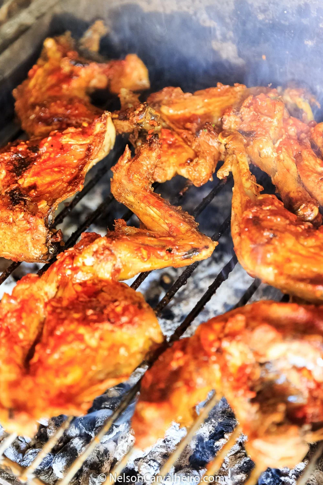

# Piri Piri chicken

Author: Nelson Carvalheiro

From: https://nelsoncarvalheiro.com/portuguese-piri-piri-chicken-recipe/

## Equipment: 
- Blender
- Oven or grill

## Ingredients:
- [ ] 1 whole chicken
- [ ] 10 cloves garlic
- [ ] 3 red chillies, diced
- [ ] 3 bay leaves
- [ ] 1 tsp paprika
- [ ] 1 bunch parsley

## Method:
1. Let the chicken come to room temp
2. Cut the chicken into pieces
3. Season the chicken with salt
4. Prepare the sauce; combine the olive oil, crushed garlic, chillies, paprika and bay leaves in a pan and cook gently for a while.
5. Once the sauce has cooled, remove the bay leaves and blend the sauce
6. Roast the chicken pieces on the highest setting so they get nice and crunchy.
7. When the chicken is nearly ready, baste it generously with the sauce several times.