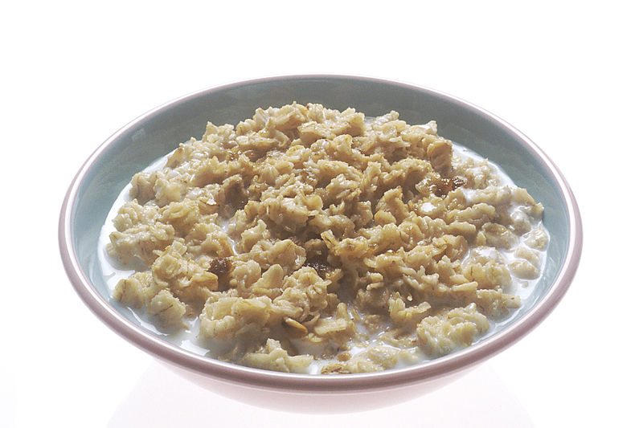

# Porridge

Author: Me

From: www.porridge.com

Servings: 1

Preparation: 1 minutes

Cooking: 5 minutes

Notes: easy peasy

## Equipment: 
- Small saucepan
- Stove

## Ingredients:
- [ ] 50 g oats
- [ ] 100 ml water
- [ ] Brown sugar

## Method:
1. Put the oats and water in the pan
2. Cook until the desired thickness is reached
3. Serve with some brown sugar to taste